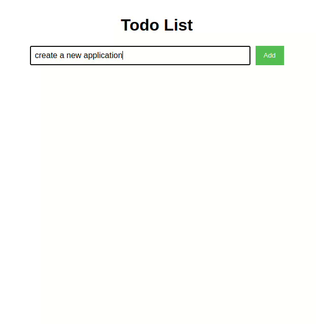

# Understanding DOM Manipulation: Simple Todo App

This is a simple todo app that demonstrates the use of DOM manipulation in JavaScript. The app allows users to add, delete, and mark todos as completed..

## Files

- `basic-no_state/index.html`
  - This file contains the basic structure of the todo app with no state management.
  - It demonstrates how to add, delete, and mark todos as completed without using any state management.
  - Uses `document.createElement`, `document.getElementById`, `appendChild`, `addEventListener`, and `classList` to manipulate the DOM.

- `basic-state/index.html`
  - This file contains the basic structure of the todo app with state management using a temporary todos map.
  - There are 3 functions `addTodoItem`, `deleteTodoItem`, and `toggleTodoItem` that manipulate the state of the todos map.
  - Event listeners are added to the buttons and todo items to call these functions when clicked and update the DOM accordingly.

- `basic-state2/index.html`
  - This file contains the basic structure of the todo app with state management and methods to add, delete, and mark todos as completed.
  - The state is managed using a temporary todos map and there is a object `TodoManager` that contains methods to add, delete, and toggle todos.
  - The functions `addTodoItem`, `deleteTodoItem`, and `toggleTodoItem` are called when the buttons and todo items are clicked.
  - In addition to updating the state, the functions also update the DOM to reflect the changes directly.

- `virtual-state/index.html`
  - This file contains the basic structure of the todo app with 2 states current state and old state to demonstrate virtual DOM.
  - The state is managed using arrays `currentTodoState` and `oldTodoState` which will be used to calculate the diff between the old and new states.
  - The functions `addTodo`, `deleteTodo`, and `toggleTodo` are called when the buttons and todo items are clicked and update the current state.
  - The `updateState` function calculates the diff between the old and new states and updates the DOM accordingly which is similar to how virtual DOM works in React.
